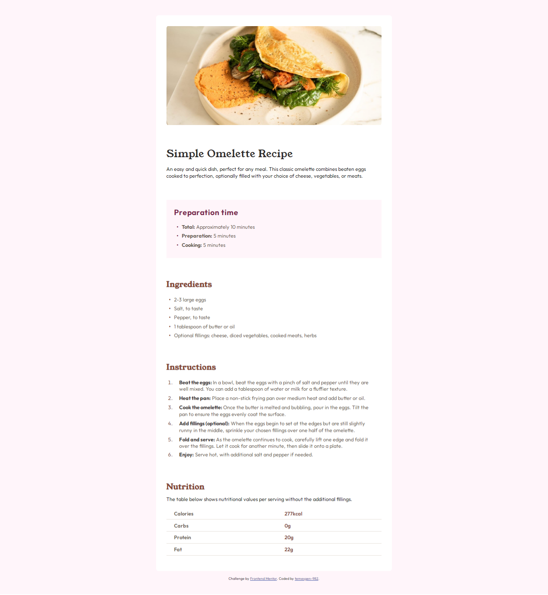

# Recipe page

This is a solution to the [Recipe page challenge on Frontend Mentor](https://www.frontendmentor.io/challenges/recipe-page-KiTsR8QQKm).

### Screenshot

### Links

- Solution URL: [Frontend Mentor]([https://your-solution-url.com](https://www.frontendmentor.io/solutions/recipe-page-eMUomIEhiv))
- Live Site URL: [https://temesgen-982.github.io/recipe-page/](https://temesgen-982.github.io/recipe-page/))

## My process

### Built with

- Semantic HTML5 markup
- CSS custom properties
- CSS Grid
- Mobile-first workflow
